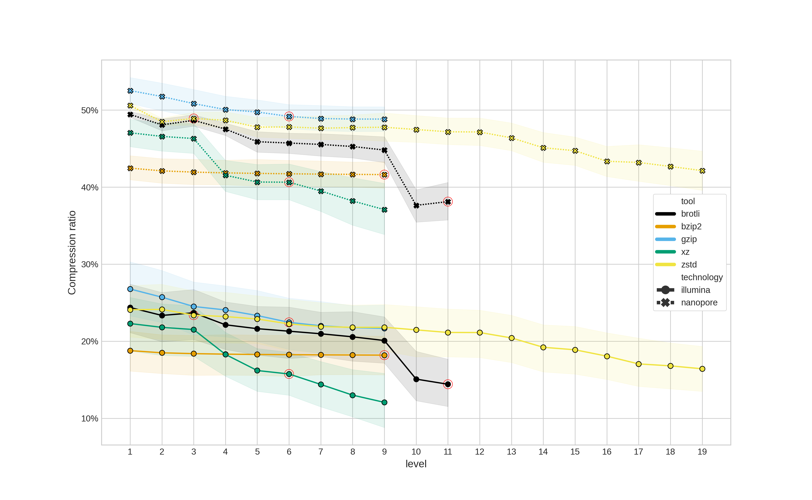

# Compression benchmark

Benchmarking fastq compression with standard (mature) compression algorithms

## Motivation

This behcmark is motivated by a recent question from Ryan Connor on the µbioinfo Slack
group

> my impression is that bioinformatics really likes gzip (and only gzip?), but that
> there are other generic compression algs that are better (for bioinfo data types);
> assuming you agree (if not, why not?), why haven't the others compression types caught
> on in bioinformatics?

It kicked off a really interesting discussion, which led me to dig into the literature
and see what I could find. I'm sure I could search deeper and for longer, but I really
couldn't find any benchmarks that satisfied me. Don't get me wrong, there are plenty of
benchmarks, but they're always looking at bioinformatics-specific tools for compressing
sequencing data. Sure, these perform well, but every repository I went to was untouched
in a while. When archiving data, the last thing I want is to try and decompress my data
and the tool no longer installs/works on my system. In addition, I want the tool to be
ubiquitous and mature. I know this is a lot of constraints, but hey, that's what I am
interested in.

> **This benchmark only covers ubiquitous/mature/generic compression tools**

## Methods

### Tools

The tools tested in this benchmark are:

* [`gzip`][gzip]
* [`xz`][xz]
* [`bzip2`][bzip2]
* [`zstd`][zstd]

These tools were used as they were the main ones that popped up in our discussion. Feel
free to
raise an issue on this repository if you would like to see another tool included.

All compression level settings were tested for each tool and default settings were used
for all other options.

### Data

The data used to test each tool are fastqs:

#### Nanopore

- [ERR3152364](https://www.ebi.ac.uk/ena/browser/view/ERR3152364): Metagenome
  from <https://doi.org/10.1093/gigascience/giz043>
- [ERR9030439](https://www.ebi.ac.uk/ena/browser/view/ERR9030439) - *Mycobacterium
  tuberculosis* from <https://doi.org/10.1016/S2666-5247(22)00301-9>
- [SRR11038964](https://www.ebi.ac.uk/ena/browser/view/SRR11038964) - *Escherichia coli*
  from <https://doi.org/10.1016/j.envpol.2020.115081>
- [SRR12695179](https://www.ebi.ac.uk/ena/browser/view/SRR12695179) - *Listeria
  monocytogenes* from <https://doi.org/10.1128/MRA.01159-20>
- [SRR24283715](https://www.ebi.ac.uk/ena/browser/view/SRR24283715) - *Salmonella
  enterica*
- [ERR10367342](https://www.ebi.ac.uk/ena/browser/view/ERR10367342) - *Klebsiella
  pneumoniae* from <https://doi.org/10.1099/mgen.0.000132>
- [ SRR24015950 ](https://www.ebi.ac.uk/ena/browser/view/SRR24015950) - *S. enterica*
- [ SRR15422103 ](https://www.ebi.ac.uk/ena/browser/view/SRR15422103) - Seawater
  metagenome from <https://doi.org/10.1016/j.watres.2022.119282>
- [ SRR13044184 ](https://www.ebi.ac.uk/ena/browser/view/SRR13044184) - *Mus musculus*
- [ SRR22859778 ](https://www.ebi.ac.uk/ena/browser/view/SRR22859778) - *Staphylococcus
  aureus* from <https://doi.org/10.1101/2023.03.28.534496>

#### Illumina

- [ ERR2935805 ](https://www.ebi.ac.uk/ena/browser/view/ERR2935805) - Metagenome
  from <https://doi.org/10.1093/gigascience/giz043>
- [ ERR9030317 ](https://www.ebi.ac.uk/ena/browser/view/ERR9030317) - *M. tuberculosis*
  from <https://doi.org/10.1016/S2666-5247(22)00301-9>
- [ SRR11038976 ](https://www.ebi.ac.uk/ena/browser/view/SRR11038976) - *E. coli*
  from <https://doi.org/10.1016/j.envpol.2020.115081>
- [ SRR12695183 ](https://www.ebi.ac.uk/ena/browser/view/SRR12695183) - *L.
  monocytogenes* from <https://doi.org/10.1128/MRA.01159-20>
- [ SRR24283718 ](https://www.ebi.ac.uk/ena/browser/view/SRR24283718) - *S. enterica*
- [ ERR1023775 ](https://www.ebi.ac.uk/ena/browser/view/ERR1023775) - *K. pneumoniae*
  from <https://doi.org/10.1099/mgen.0.000132>
- [ SRR24015952 ](https://www.ebi.ac.uk/ena/browser/view/SRR24015952) - *S. enterica*
- [ SRR22859722 ](https://www.ebi.ac.uk/ena/browser/view/SRR22859722) - *S. aureus*
  from <https://doi.org/10.1101/2023.03.28.534496>
- [ SRR098024 ](https://www.ebi.ac.uk/ena/browser/view/SRR098024) - *Homo sapiens*
- [ SRR077288 ](https://www.ebi.ac.uk/ena/browser/view/SRR077288) - *Maylandia zebra*
  from <https://doi.org/10.1038/nature13726>

Note: I couldn't find sources for all of these samples. If you can fill in some of the
gaps, please raise an issue and I will gladly update the sources.

All data were downloaded with [`fastq-dl`][fastq_dl] (v2.0.1). Paired Illumina data were
combined into a single fastq file.

## Results

### Compression ratio

The first question is how much smaller does each compression tool make a fastq file. As
this also depends on the compression level selected, all possible levels were tested for
each tool (the default being indicated with a red circle).

The compression ratio is a percentage of the original file size - i.e.,
$\frac{compressed size}{uncompressed size}$.

---

*Figure 1: Compression ratio (y-axis) for different compression tools and
levels. Compression ratio is a percentage of the original file size. The red circles
indicate the default compression level for each tool. Illumina data is represented with
a solid line and circular points, whereas Nanopore data is a dashed line with cross
points.*

---

The most striking result here is the noticeable different in compression ratio between
Illumina and Nanopore data - regardless of the compression tool used. (If anyone can
suggest a reason for this, please raise an issue.)

Using default settings, `zstd` and `gzip` provide similar ratios, as do `xz`
and `bzip2` (however, compression level doesn't seem to actually change the ratio
for `bzip2`). When using the highest compression level `xz` provides the best compression (however, this comes at a cost to runtime as we'll see below).

### (De)compression rate and memory usage

[gzip]: http://www.gzip.org/

[bzip2]: https://sourceware.org/bzip2/

[xz]: https://tukaani.org/xz/

[zstd]: https://github.com/facebook/zstd

[fastq_dl]: https://github.com/rpetit3/fastq-dl